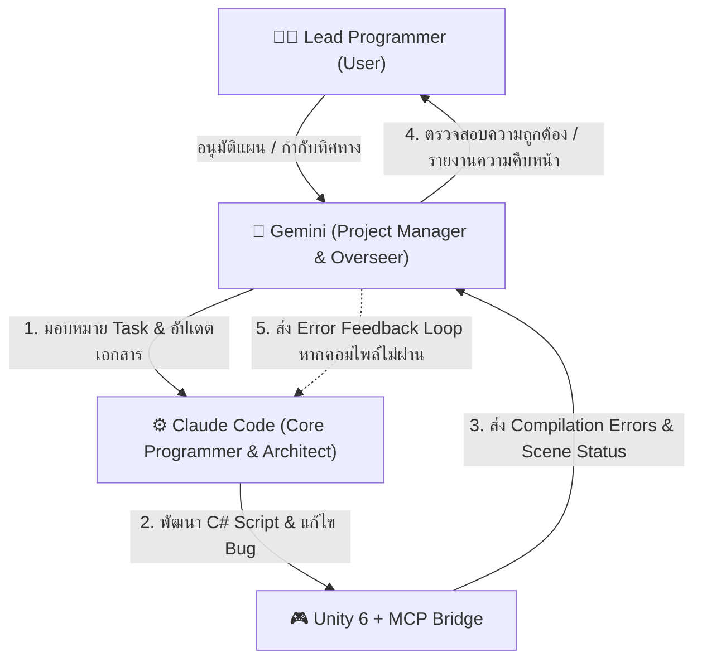

# 🤖 Multi-AI Collaboration Guide & Workflow
> **Project:** The Cave Dweller : Mole!! โคตรตุ่นคลั่ง ฝังมิดด้าม!!  
> **Lead Programmer (User):** William (วิลเลี่ยม)  
> **Project Manager & Overseer:** Gemini (Antigravity)  
> **Core Programmer & Architect:** Claude Code  
> **Timeframe:** 1 Week (Final Sprint to Class Submission)

---

## 1. 👥 การแบ่งหน้าที่และความรับผิดชอบ (Division of Responsibilities)



| บทบาท | ผู้รับผิดชอบ | ขอบเขตความรับผิดชอบหลัก |
| :--- | :--- | :--- |
| **Lead Programmer** | **คุณ (User)** | เจ้าของโปรเจกต์ ตัดสินใจเรื่อง Game Design, Approve แผนงาน, และทดสอบการเล่นจริงใน Unity Editor |
| **Project Manager & Overseer** | **Gemini** | • ดูแลภาพรวมของโปรเจกต์และเอกสารทั้งหมด (`GDD`, `game-architect.md`, `TODO.md`)<br>• เชื่อมต่อและควบคุม **Unity MCP** (ตรวจ Scene Hierarchy, ตรวจสอบ Compilation Errors)<br>• ควบคุม Scope งานให้อยู่ในกรอบ 1 สัปดาห์<br>• คอยสรุปสถานะและประสานงาน |
| **Core Programmer & Architect** | **Claude Code** | • วาง Architecture และพัฒนา C# Scripts ทั้งหมดใน `Assets/Script/`<br>• เขียนโค้ดตามสเปกใน [game-architect.md](file:///e:/Unity/The-cave-dweller-..Mole-/game-architect.md)<br>• ดีบักเชิงลึก (Deep Debugging) และจัดการ Error โค้ด<br>• ปรับแต่ง Logic ฟิสิกส์และการยิงลูกซอง |

---

## 2. ⚡ วงจรการทำงานร่วมกัน (Autonomous Collaboration Pipeline)

เพื่อให้การทำงานดำเนินไปได้อย่างรวดเร็วและเป็นระเบียบ เราจะใช้กระบวนการ 4 ขั้นตอน:

```text
[Step 1: Task Assignment]
    Gemini กำหนด Task ย่อย และระบุเงื่อนไขในกระดานงาน
         │
         ▼
[Step 2: Code Implementation]
    Claude พัฒนา C# Script ลงใน Assets/Script/ ตามสเปกสถาปัตยกรรม
         │
         ▼
[Step 3: Verification via Unity MCP]
    Gemini รันการตรวจสอบการคอมไพล์ผ่าน Unity MCP (`compilation/errors`)
    ├─► [มี Error] ──► Gemini ส่ง Error Trace กลับให้ Claude แก้ไขทันที
    └─► [ผ่านฉลุย] ──► Gemini ผูก Component / ตรวจ Scene ผ่าน Unity MCP
         │
         ▼
[Step 4: Milestone Sign-off]
    Gemini อัปเดต Task Board และรายงาน Lead Programmer (User) ให้ลองทดสอบ Play Mode
```

---

## 3. 📋 กฎเหล็กในการทำงานร่วมกัน (Collaboration Rules)

1. **ไม่เดาข้อมูลเอง (Strictly No Guessing):**  
   หากมีจุดใดใน GDD หรือตรรกะของเกมที่คลุมเครือ ต้องถาม Lead Programmer ก่อนเสมอ
2. **Modular Code Standard:**  
   ห้ามเขียนโค้ดผูกมัดกับ Asset ชิ้นใดชิ้นหนึ่งแบบ Hardcoded ต้องรองรับการสลับ Sprite ของ 2D Artist ที่จะส่งมอบในภายหลัง
3. **Unity MCP Single-Source-of-Truth:**  
   การเช็คว่าโค้ดคอมไพล์ผ่านหรือไม่ หรือ GameObject อยู่ในสถานะใด จะอิงจากผลลัพธ์ของ Unity MCP เสมอ เพื่อความแม่นยำ 100%
4. **Scope Control (สำคัญที่สุดใน 1 สัปดาห์):**  
   ยึดมั่นใน Core Loop: *เดิน/กระโดด/Dash + ลูกซองยิงเปิดไฟ + มอนสเตอร์ 2 ชนิด + ทางออก Exit Door* ห้ามเพิ่มฟีเจอร์นอกเหนือจากแผนหาก Core Loop ยังไม่สมบูรณ์

---

## 4. 🗂️ เอกสารอ้างอิงของโปรเจกต์
- 📐 **Game Architecture:** [game-architect.md](file:///e:/Unity/The-cave-dweller-..Mole-/game-architect.md)
- 📄 **Game Design Document:** [GDD Overview for MVP (Rapid Game) II.pdf](file:///e:/Unity/The-cave-dweller-..Mole-/Ai%20Assitance/GDD%20Overview%20for%20MVP%20(Rapid%20Game)%20II.pdf)
- 🎮 **Active Scene:** [Assets/Scenes/code.unity](file:///e:/Unity/The-cave-dweller-..Mole-/Assets/Scenes/code.unity)
