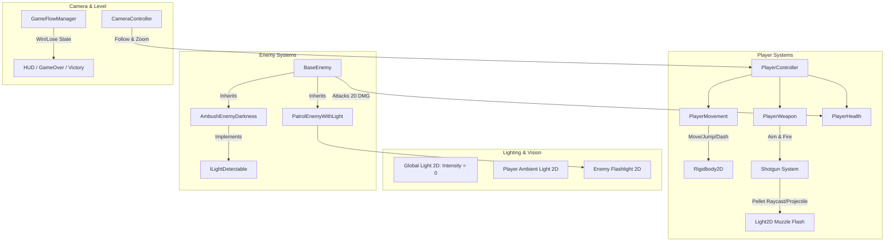

# 🏗️ Game Architecture Specification: The Cave Dweller - Mole!!
> **Target Audience:** Claude (Core Game Programmer & Architect) & Lead Programmer (User)  
> **Engine:** Unity 6 (6000.5.8f1) — Universal Render Pipeline (URP 2D)  
> **Deadline:** 7 Days (1-Week Sprint to MVP Submission)  
> **Project Root:** `E:\Unity\The-cave-dweller-..Mole-`

---

## 1. 🎯 Architectural Goals & Principles

1. **Modular & Component-Based (SOLID):**  
   แยกส่วนการทำงานออกจากกันเด็ดขาด (Decoupled Components) ผ่าน C# Interfaces เช่น `IDamageable`, `ILightDetectable` เพื่อให้สามารถเทสต์และสลับเปลี่ยน Sprite / Animation ของ 2D Artist ได้ในอนาคตโดยไม่ต้องแก้โค้ดระบบ
2. **Physics & Rendering in 2D URP:**  
   ใช้ `Rigidbody2D` และ `BoxCollider2D` สำหรับการเคลื่อนไหวและการชน และใช้ `UnityEngine.Rendering.Universal.Light2D` สำหรับกลไกความมืด (Pitch Black) และแสงจากปืน/ไฟฉาย
3. **Clean Assembly & Namespaces:**  
   โค้ดทั้งหมดจะอยู่ใน Namespace `CaveDweller.*` ในโฟลเดอร์ `Assets/Script/`
4. **Input System Compatible:**  
   รองรับระบบควบคุมผ่าน Unity New Input System (`UnityEngine.InputSystem`) ควบคู่กับ Keyboard & Mouse

---

## 2. 🧩 High-Level System Overview



---

## 3. 📦 Core Interfaces & Event Contracts

### 3.1 `IDamageable.cs`
```csharp
namespace CaveDweller.Combat
{
    public interface IDamageable
    {
        int CurrentHealth { get; }
        int MaxHealth { get; }
        void TakeDamage(int amount);
        bool IsDead { get; }
    }
}
```

### 3.2 `ILightDetectable.cs`
ใช้สำหรับมอนสเตอร์ประเภทที่ 2 (ซุ่มในที่มืด) หรือวัตถุที่ไวต่อแสงไฟฉาย/แสงกระสุน:
```csharp
namespace CaveDweller.Lighting
{
    public interface ILightDetectable
    {
        void OnIlluminated(float intensity);
        void OnDarkened();
    }
}
```

---

## 4. 🕹️ Detailed Module Specifications

### 4.1 Player System (`CaveDweller.Player`)

#### A. `PlayerMovement.cs`
* **หน้าที่:** จัดการฟิสิกส์การเดิน, กระโดด, และ Dash
* **Properties & Fields:**
  * `float moveSpeed = 7f;`
  * `float jumpForce = 12f;`
  * `float dashSpeed = 16f;`
  * `float dashDuration = 0.2f;`
  * `float dashCooldown = 1.0f;`
  * `LayerMask groundLayer;`
  * `Transform groundCheckPoint;`
* **Mechanics:**
  * Ground check ด้วย `Physics2D.OverlapCircle` หรือ BoxCast
  * Dash: เคลื่อนที่ตามแกน X ในทิศทางที่หัน พร้อมปิด Gravity ชั่วคราวในช่วง Dash Duration และตั้งเวลา Cooldown 1 วินาที (กดปุ่ม `Left Shift`)

#### B. `PlayerWeapon.cs`
* **หน้าที่:** ระบบเล็ง 360 องศาตามเมาส์ และการยิงปืนลูกซอง 2 นัด
* **Properties & Fields:**
  * `int maxAmmo = 2;`
  * `int currentAmmo = 2;`
  * `float reloadTime = 1.2f;`
  * `int pelletsCount = 6;` (จำนวนเม็ดลูกซองต่อการยิง 1 นัด)
  * `float spreadAngle = 18f;`
  * `float bulletRange = 12f;`
  * `int damagePerPellet = 20;`
  * `Light2D muzzleFlashLight;` (แสงไฟส่องสว่างตอนยิง)
  * `GameObject bulletTracerPrefab;` (กระสุนพร้อม Point Light2D ติดไปกับหัวกระสุน)
* **Mechanics:**
  * คำนวณมุมเล็งจากตำแหน่งผู้เล่นไปยัง Mouse Screen Position:
    `Vector3 mouseWorldPos = Camera.main.ScreenToWorldPoint(Input.mousePosition);`
  * ยิงกระจายตามมุม `spreadAngle`
  * เมื่อง้างยิง: เปิด `muzzleFlashLight` ทันที และใช้ Coroutine ปิดแสงลงใน 0.1 - 0.2 วินาที (วาบแสง)
  * กดยิงเมื่อกระสุน = 0 หรือกดปุ่ม `R` จะทำการ Reload อัตโนมัติ

#### C. `PlayerHealth.cs`
* **หน้าที่:** รับดาเมจและแจ้งสถานะการตาย
* **Properties & Fields:**
  * `int maxHp = 100;`
  * `int currentHp = 100;`
  * `bool isInvulnerable = false;` (I-Frames สั้นๆ 0.5s หลังโดนตี เพื่อป้องกันโดนตอดซ้ำทันที)
* **Mechanics:**
  * เมื่อมอนสเตอร์โจมตี ลดเลือดครั้งละ 20 HP
  * ไม่มีการฟื้นฟูเลือด (ตาม GDD)
  * เลือด <= 0 เรียก `GameFlowManager.Instance.OnPlayerDied()`

---

### 4.2 Enemy AI System (`CaveDweller.Enemies`)

#### A. `BaseEnemy.cs` (Abstract Class)
* สืบทอด `MonoBehaviour`, `IDamageable`
* มีฟังก์ชันพื้นฐาน: `TakeDamage()`, `Die()`, `DealDamageToPlayer()`

#### B. `PatrolEnemyWithLight.cs` (ศัตรูประเภทที่ 1: ถือไฟ)
* **พฤติกรรม:**
  * มี State: `Patrol`, `Chase`, `Attack`
  * เดินลาดตระเวนซ้าย-ขวาระหว่าง Patrol Points
  * มี Spot Light 2D ส่องไปด้านหน้า
  * ตรวจจับ Player ผ่าน `Raycast2D` ภายในระยะและมุมมองของไฟฉาย
  * เมื่อพบ Player จะเปลี่ยนเป็น State `Chase` และวิ่งเข้าหาเพื่อโจมตี (20 Damage)
  * พลังชีวิต: โดนลูกซองจังๆ 2 นัดตาย

#### C. `AmbushEnemyDarkness.cs` (ศัตรูประเภทที่ 2: ซุ่มในมุมมืด)
* **พฤติกรรม:**
  * สืบทอด `ILightDetectable`
  * **อยู่นิ่งกับที่ (Stationary)** กลมกลืนไปกับความมืด
  * ตรวจสอบ:
    1. ผู้เล่นเดินเข้ามาในระยะประชิด (Proximity Trigger เช่น 2.5m)
    2. ได้รับแสงสว่างจากไฟฉายหรือแสงลูกซอง (`OnIlluminated`)
  * เมื่อตื่นขึ้น จะกระโจนหรือพุ่งโจมตีผู้เล่นทันที
  * พลังชีวิต: โดนลูกซอง 1 นัดตาย

---

### 4.3 Lighting & Atmosphere System (`CaveDweller.Environment`)

1. **Global Darkness:**
   * ฉากจะมี `Global Light 2D` โดยปรับ Color เป็นสีดำมืดมิด (`Intensity = 0.05f` เพื่อให้เห็นเค้าโครงฉากเพียงจางๆ)
2. **Player Ambient Light:**
   * มี Point Light 2D วงเล็กๆ ติดตัวผู้เล่น (`Radius = 1.5m, Intensity = 0.3f`)
3. **Muzzle Flash Light:**
   * สว่างวาบเฉพาะช่วงเสี้ยววินาทีของการลั่นไก (`Radius = 8m - 12m, Intensity = 2.0f`)
4. **Bullet Tracer Light:**
   * กระสุนลูกซองแต่ละนัดมี Point Light 2D เล็กๆ นำทางไปตามวิถีกระสุนเพื่อเปิดเผยพื้นที่ข้างหน้า

---

### 4.4 Camera & Game Flow (`CaveDweller.Core`)

#### A. `CameraController.cs`
* ติดตามตำแหน่งของ `Player` แบบ Smooth Follow (Damping)
* รองรับ **Mouse Scroll Wheel Zoom**:
  * ขยาย Orthographic Size จาก Min (5.0) ไป Max (8.5) เพื่อให้ผู้เล่นเลื่อนสำรวจพื้นที่ได้ แต่ความมืดและแสงยังคงเท่าเดิม

#### B. `GameFlowManager.cs` (Singleton)
* ตรวจสอบเงื่อนไข:
  * **Win Condition:** ผู้เล่นเดินทางไปถึง Trigger ของ `ExitDoor` ที่ชั้นบนสุดของเหมือง
  * **Lose Condition:** Player HP ลดลงเหลือ 0
* จัดการโหลด Scene ใหม่หรือแสดง Game Over / Victory UI

---

## 5. 📂 Recommended Project Folder Structure

```text
Assets/
├── Script/
│   ├── Core/
│   │   ├── GameFlowManager.cs
│   │   └── CameraController.cs
│   ├── Combat/
│   │   ├── IDamageable.cs
│   │   └── Projectile.cs
│   ├── Player/
│   │   ├── PlayerController.cs
│   │   ├── PlayerMovement.cs
│   │   ├── PlayerWeapon.cs
│   │   └── PlayerHealth.cs
│   ├── Enemies/
│   │   ├── BaseEnemy.cs
│   │   ├── PatrolEnemyWithLight.cs
│   │   └── AmbushEnemyDarkness.cs
│   └── Lighting/
│       ├── ILightDetectable.cs
│       └── DynamicMuzzleLight.cs
├── Prefabs/
│   ├── Player.prefab
│   ├── Enemy_Light.prefab
│   ├── Enemy_Dark.prefab
│   ├── BulletTracer.prefab
│   └── ExitDoor.prefab
└── Scenes/
    └── code.unity (Level 1 MVP)
```

---

## 6. 🚀 Same-Day MVP Prototype Roadmap (เป้าหมาย: เสร็จและเล่นได้จริงภายในวันนี้)

| ลำดับงาน (Phase) | ฟีเจอร์ / โมดูล | ผู้รับผิดชอบ | สถานะ |
| :--- | :--- | :--- | :---: |
| **Phase 1: Movement & Camera** | `PlayerMovement.cs` (Walk/Jump/Dash) & `CameraController.cs` (Zoom) | Gemini & Claude | **DONE ✅** |
| **Phase 2: Weapon & Lighting** | `PlayerWeapon.cs` (Shotgun 2 นัด, Mouse Aim 360°) & Muzzle Flash Light2D | **Claude** (โค้ด) / Gemini (เซ็ตแสง) | **IN PROGRESS ⏳** |
| **Phase 3: Core Enemies** | `PatrolEnemyWithLight.cs` (ถือไฟ) & `AmbushEnemyDarkness.cs` (ซุ่มมืด) | **Claude** (โค้ด) / Gemini (ผูก Scene) | **TODO ⏳** |
| **Phase 4: Combat & Health** | `PlayerHealth.cs` (100 HP, โดนตีละ 20) & `IDamageable.cs` | **Claude** | **TODO ⏳** |
| **Phase 5: Level Loop & Win/Lose**| `ExitDoor` (ทางออกหนีจากถ้ำ) & ตรวจสอบเงื่อนไข ชนะ/แพ้ | Gemini & Claude | **TODO ⏳** |

